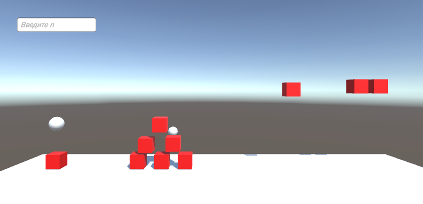
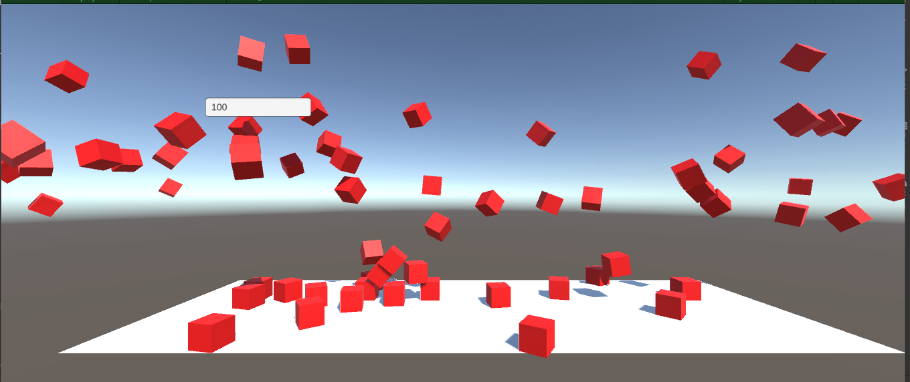

# АНАЛИЗ ДАННЫХ И ИСКУССТВЕННЫЙ ИНТЕЛЛЕКТ [in GameDev]
Отчет по лабораторной работе #1 выполнил(а):
- Морозов Андрей Андреевич
- РИ300022
Отметка о выполнении заданий (заполняется студентом):

| Задание | Выполнение | Баллы |
| ------ |------------| ------ |
| Задание 1 | *          | 60 |
| Задание 2 | *          | 20 |
| Задание 3 | *          | 20 |

знак "*" - задание выполнено; знак "#" - задание не выполнено;

Работу проверили:

Структура отчета

- Данные о работе: название работы, фио, группа, выполненные задания.
- Цель работы.
- Задание 1.
- Код реализации выполнения задания. Визуализация результатов выполнения (если применимо).
- Задание 2.
- Код реализации выполнения задания. Визуализация результатов выполнения (если применимо).
- Задание 3.
- Код реализации выполнения задания. Визуализация результатов выполнения (если применимо).
- Выводы.
- ✨Magic ✨

## Цель работы
Ознакомиться с основными функциями Unity и взаимодействием с объектами внутри редактора.

## Задание 1
### В разделе «ход работы» пошагово выполнить каждый пункт с описанием и примера реализации задач по теме видео самостоятельной работы.
Ход работы:
1) Создать новый проект из шаблона 3D – Core;
2) Проверить, что настроена интеграция редактора Unity и Visual Studio Code
   (пункты 8-10 введения);
3) Создать объект Plane;
4) Создать объект Cube;
5) Создать объект Sphere;
6) Установить компонент Sphere Collider для объекта Sphere;
7) Настроить Sphere Collider в роли триггера;
8) Объект куб перекрасить в красный цвет;
9) Добавить кубу симуляцию физики, при это куб не должен проваливаться
   под Plane;
10) Написать скрипт, который будет выводить в консоль сообщение о том,
    что объект Sphere столкнулся с объектом Cube;
11) При столкновении Cube должен менять свой цвет на зелёный, а при
    завершении столкновения обратно на красный.

Скрипт куба меняющего цвет:
```py
using UnityEngine;

public class Cube : MonoBehaviour
{
    [SerializeField] private Renderer rd;
    private void OnTriggerEnter(Collider other)
    {
        Debug.Log("Столкновение началось");
        SetColor(Color.green);
    }

    private void OnTriggerExit(Collider other)
    {
        Debug.Log("Столкновение закончилось");
        SetColor(Color.red);
    }

    private void SetColor(Color color)
    {
        rd.material.SetColor("_Color", color);
    }
}
```

## Задание 2
### Продемонстрируйте на сцене в Unity следующее:
### - Что произойдёт с координатами объекта, если он перестанет быть дочерним?
### - Создайте три различных примера работы компонента RigidBody?
Ход работы:
1) Разобраться что произойдёт с координатами объекта, если он перестанет быть дочерним.
2) Продемонстрировать это на сцене.
3) Придумать три различных примера работы Rigidbody.
4) Показать их на сцене.

Летающий куб:
```py
using System;
using System.Collections;
using System.Collections.Generic;
using UnityEngine;

public class FlyingCube : MonoBehaviour
{
    [SerializeField] private Rigidbody rb;

    private void FixedUpdate()
    {
        if (gameObject.transform.position.y < 4)
        {
            rb.AddForce(new Vector3(0, 100, 0));
        }
    }
}
```
Сфера сбивающая кубы:
```py
using UnityEngine;

public class Sphere : MonoBehaviour
{
    [SerializeField] private Rigidbody rb;

    private void OnEnable()
    {
        rb.AddForce(new Vector3(0, 0, -1000));
    }
}
```


## Задание 3
### Реализуйте на сцене генерацию n кубиков. Число n вводится пользователем после старта сцены.

1) Сделать поле InputField.
2) Создать объект CubeSpawner.
3) Создать префаб куба.
4) Написать скрипт для CubeSpawner.
5) Настроить у InputField вызов SpawnCube в CubeSpawner, при завершении редактирования поля ввода.

```py
using System.Collections;
using System.Collections.Generic;
using TMPro;
using UnityEngine;
using UnityEngine.Serialization;
using UnityEngine.UI;

public class CubeSpawner : MonoBehaviour
{
[SerializeField] private Cube _cubePref;
[SerializeField] private TMP_InputField _field;

    public void SpawnNCubes()
    {
        var n = 0;
        if (_field.text == null || !int.TryParse(_field.text, out n)) return;
        for (var i = 0; i < n; i++)
        {
            Instantiate(_cubePref, gameObject.transform);
        }
    }
}
```


## Выводы

В ходе работы я использовал уже имеющиеся у меня знания работы в Unity, самостоятельно без видеороликов выполнил лабораторную работу.
